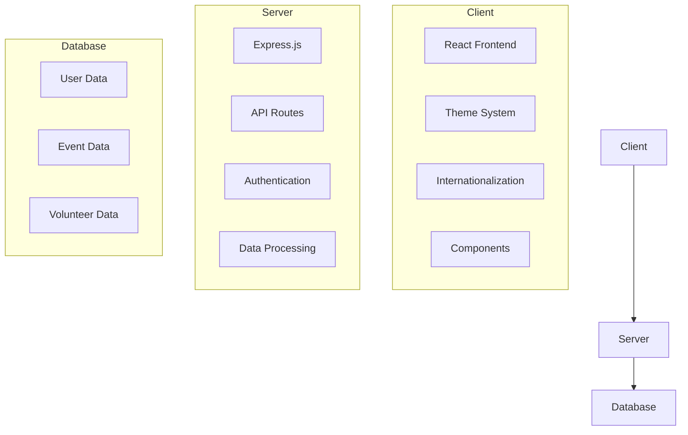
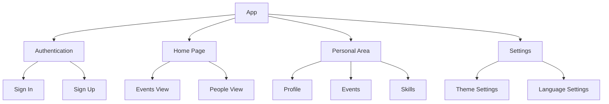
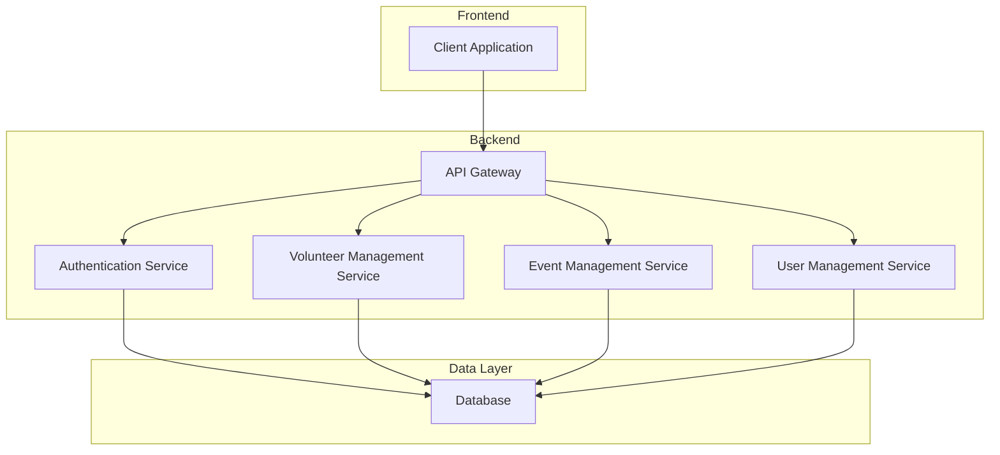

# Beit Hanina Community Center Volunteer App - Architecture and Design

## Architecture Diagram

## Design Diagram

## Architecture Overview

### Frontend (Client)
- Built with React.js
- Uses CSS variables for theming (light/dark mode)
- Implements internationalization (i18n)
- Component-based architecture
- Responsive design

### Backend (Server)
- Express.js server
- RESTful API endpoints
- Authentication system
- Data processing and validation

### Database
- Stores user information
- Manages event data
- Tracks volunteer information

## Design Patterns

1. **Component-Based Architecture**
   - Reusable UI components
   - Separation of concerns
   - Props-based communication

2. **Theme System**
   - CSS variables for consistent theming
   - Light/Dark mode support
   - Smooth transitions

3. **Internationalization**
   - Multi-language support
   - Dynamic language switching
   - Translation management

4. **State Management**
   - React Context for theme
   - Local state for components
   - API state management

## Key Features

1. **Authentication**
   - User registration
   - Login system
   - Role-based access

2. **Event Management**
   - Event creation
   - Event listing
   - Volunteer signup

3. **User Management**
   - Profile management
   - Skills tracking
   - Event history

4. **Settings**
   - Theme customization
   - Language preferences
   - User preferences

# System Architecture

## High-Level Architecture

## Components Description

### Frontend Layer
- **Client Application**: React-based web application
  - Mobile-responsive design
  - Progressive Web App (PWA) capabilities
  - State management using React Context/Redux
  - Service Worker for offline capabilities

### Backend Layer
- **API Gateway**: Express.js server
  - Request routing
  - Rate limiting
  - CORS management
  - Request validation

- **Services**:
  - Authentication Service: Handles user authentication and authorization
  - Volunteer Management Service: Manages volunteer profiles and activities
  - Event Management Service: Handles community events and scheduling
  - User Management Service: Manages user profiles and permissions

### Data Layer
- **Database**: MongoDB
  - User collections
  - Volunteer collections
  - Event collections
  - Activity logs

## Communication Flow
1. Client makes HTTP requests to API Gateway
2. API Gateway routes requests to appropriate service
3. Services process requests and interact with database
4. Responses flow back through API Gateway to client

## Security
- JWT-based authentication
- HTTPS encryption
- Role-based access control
- Input validation and sanitization
- Rate limiting
- CORS policies 