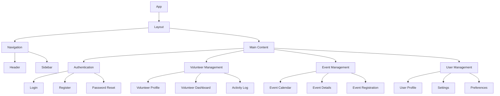
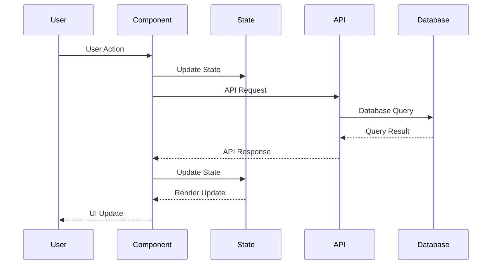

# Component Design

## Frontend Component Structure

## Component Descriptions

### Core Components
- **App**: Root component that initializes the application
- **Layout**: Main layout wrapper with navigation and content areas
- **Navigation**: Handles routing and navigation between pages

### Authentication Components
- **Login**: User authentication form
- **Register**: New user registration form
- **Password Reset**: Password recovery functionality

### Volunteer Management Components
- **Volunteer Profile**: Displays and manages volunteer information
- **Volunteer Dashboard**: Shows volunteer activities and statistics
- **Activity Log**: Tracks and displays volunteer hours and activities

### Event Management Components
- **Event Calendar**: Displays upcoming events
- **Event Details**: Shows detailed event information
- **Event Registration**: Handles event sign-ups

### User Management Components
- **User Profile**: Manages user information
- **Settings**: Application settings
- **Preferences**: User preferences and customization

## Data Flow

## State Management
- Global state for user authentication
- Local state for component-specific data
- Context API for theme and language preferences
- Redux for complex state management (if needed)

## Component Communication
- Props for parent-child communication
- Context API for global state
- Custom events for cross-component communication
- Redux for complex state sharing

## UI/UX Principles
- Mobile-first responsive design
- Consistent color scheme and typography
- Accessible components (ARIA labels, keyboard navigation)
- Loading states and error handling
- Form validation and feedback 